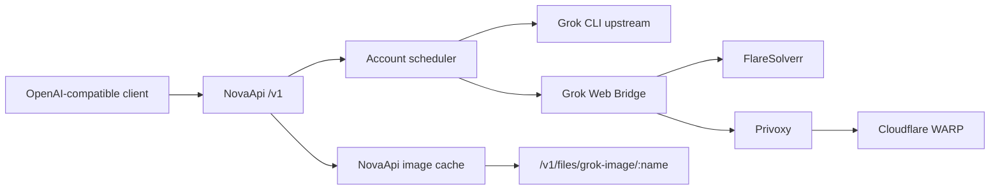

# NovaApi

基于 [Sub2API](https://github.com/Wei-Shaw/sub2api) 的多账号 AI API 网关定制版，重点补充 Grok CLI 请求兼容、Grok 账号统一管理，以及不依赖 ChatGPT2API 的 Grok Web 生图能力。

当前定制基线为 Sub2API `v0.1.149`。上游版本升级应在独立分支完成，并重新验证 Grok OAuth、调度缓存、图片 Bridge 与数据库迁移。

## 核心能力

- 统一使用 OpenAI 兼容接口调用 OpenAI、Anthropic、Gemini、Antigravity 和 Grok。
- Grok 平台统一使用 `platform=grok`，旧的 `platform=xai` 会在输入和数据库迁移中归一化。
- Grok OAuth 请求自动携带 Grok CLI 身份头，避免 CLI 版本被解析为 `version=none`。
- Grok SSO 免费生图直接从 NovaApi 的 Grok 账号读取 `sso_token`，不依赖 ChatGPT2API 运行时。
- 支持 `grok-imagine-image` 和 `grok-imagine-image-lite` 通过 Web Bridge 生图。
- 图片响应支持 OpenAI 格式的 `url` 和 `b64_json`。
- URL 模式的图片保存在 NovaApi 数据卷，并通过 `/v1/files/grok-image/:name` 读取。
- 调度元数据只缓存 `grok_sso_available=true`，不会把 SSO Token 写入瘦调度快照。

## Grok 请求兼容

NovaApi 向 Grok CLI 上游发送以下身份头：

```http
User-Agent: grok-pager/0.2.93 grok-shell/0.2.93 (linux; x86_64)
X-XAI-Token-Auth: xai-grok-cli
x-grok-client-identifier: grok-pager
x-grok-client-version: 0.2.93
```

这些 Header 由服务端设置，API 调用方无需手动传递。

### 图片模型分流

| 模型 | 账号条件 | 实际上游 |
| --- | --- | --- |
| `grok-imagine-image` | 账号包含 SSO | NovaApi Grok Web Bridge |
| `grok-imagine-image` | API Key 或无 SSO | 官方 xAI Images API |
| `grok-imagine-image-lite` | 必须包含 SSO | NovaApi Grok Web Bridge |
| `grok-imagine-image-quality` | 官方凭据 | 官方 xAI Images API |
| `grok-imagine-edit` | 官方凭据 | 官方 xAI Images API |
| `grok-imagine-video*` | 官方凭据 | 官方 xAI Videos API |

Web 生图账号的 `credentials` 必须包含有效的 `sso_token`。OAuth 聊天仍使用 `access_token`，两条链路互不替代。

## 架构



Grok Web Bridge、FlareSolverr、Privoxy 和 WARP 都由本项目的 Docker Compose 管理。Bridge 只通过内部共享密钥接受 NovaApi 请求。

## 快速部署

### 环境要求

- Linux amd64 或 arm64
- Docker Engine
- Docker Compose plugin
- 建议至少 2 GB 内存和可用 Swap

### 获取代码

```bash
git clone git@github.com:AuuCoder/NovaApi.git
cd NovaApi/deploy
cp .env.example .env
```

至少修改以下配置：

```dotenv
POSTGRES_PASSWORD=replace-with-a-strong-password
ADMIN_PASSWORD=replace-with-an-admin-password
JWT_SECRET=replace-with-a-fixed-random-secret
GROK_WEB_BRIDGE_KEY=replace-with-a-random-internal-key
```

可以使用以下命令生成随机值：

```bash
openssl rand -hex 32
```

启动全部组件：

```bash
docker compose up -d --build
docker compose ps
```

主要容器：

| 容器 | 用途 |
| --- | --- |
| `sub2api` | API 网关与管理后台 |
| `sub2api-postgres` | PostgreSQL 数据库 |
| `sub2api-redis` | 缓存、并发控制与调度快照 |
| `sub2api-grok-web-bridge` | Grok Web 生图内部服务 |
| `sub2api-grok-flaresolverr` | Clearance 预热与挑战处理 |
| `sub2api-grok-privoxy` | HTTP 到 WARP SOCKS 的代理桥接 |
| `sub2api-grok-warp-proxy` | Grok Web 出口网络 |

## 配置

Grok Web 生图相关环境变量：

| 变量 | 默认值 | 说明 |
| --- | --- | --- |
| `GROK_WEB_BRIDGE_KEY` | 无 | NovaApi 与 Bridge 的内部共享密钥，必须设置 |
| `GATEWAY_GROK_WEB_BRIDGE_URL` | `http://grok-web-bridge:8090/generate` | NovaApi 调用 Bridge 的内部地址 |
| `GATEWAY_GROK_WEB_DEFAULT_PROXY_URL` | `http://grok-privoxy:8118` | 默认 Web 生图代理 |
| `GATEWAY_GROK_IMAGE_CACHE_DIR` | `/app/data/grok-images` | URL 响应图片保存目录 |
| `GATEWAY_GROK_IMAGE_RETENTION_HOURS` | `24` | 图片保留时间 |
| `GROK_FLARESOLVERR_URL` | `http://grok-flaresolverr:8191` | Bridge 使用的 FlareSolverr 地址 |
| `GROK_FLARESOLVERR_LOG_LEVEL` | `info` | FlareSolverr 日志级别 |

完整配置见 [`deploy/.env.example`](deploy/.env.example) 和 [`deploy/docker-compose.yml`](deploy/docker-compose.yml)。

## API 调用

以下示例统一使用 NovaApi 生成的 API Key。不要把真实密钥提交到仓库。

### Grok 聊天

```bash
curl "https://your-domain.example/v1/chat/completions" \
  -H "Authorization: Bearer YOUR_API_KEY" \
  -H "Content-Type: application/json" \
  -d '{
    "model": "grok-4.5",
    "messages": [
      {"role": "user", "content": "你好"}
    ],
    "stream": false
  }'
```

### Grok 生图：URL 响应

```bash
curl "https://your-domain.example/v1/images/generations" \
  -H "Authorization: Bearer YOUR_API_KEY" \
  -H "Content-Type: application/json" \
  -d '{
    "model": "grok-imagine-image",
    "prompt": "一只戴着宇航员头盔的橘猫",
    "n": 1,
    "response_format": "url"
  }'
```

成功响应：

```json
{
  "created": 1784368749,
  "data": [
    {
      "url": "https://your-domain.example/v1/files/grok-image/IMAGE_ID.jpg"
    }
  ]
}
```

### Grok 生图：Base64 响应

```bash
curl "https://your-domain.example/v1/images/generations" \
  -H "Authorization: Bearer YOUR_API_KEY" \
  -H "Content-Type: application/json" \
  -d '{
    "model": "grok-imagine-image-lite",
    "prompt": "一枚蓝色玻璃立方体，白色背景",
    "n": 1,
    "response_format": "b64_json"
  }'
```

## 账号数据

Grok 账号使用 `platform=grok`。免费 Web 生图至少需要：

```json
{
  "platform": "grok",
  "type": "oauth",
  "credentials": {
    "access_token": "REDACTED",
    "refresh_token": "REDACTED",
    "sso_token": "REDACTED"
  }
}
```

管理接口会对 `sso_token` 脱敏。数据库迁移 `173_normalize_xai_platform_to_grok.sql` 会将历史 `xai` 平台标识归一化为 `grok`。

## 本地开发

后端：

```bash
cd backend
go test -tags unit ./internal/service ./internal/repository ./internal/server/routes ./internal/handler
go build ./cmd/server
```

前端：

```bash
cd frontend
corepack enable
pnpm install --frozen-lockfile
pnpm run typecheck
pnpm run build
```

Bridge：

```bash
docker build -t sub2api/grok-web-bridge:local deploy/grok-web-bridge
```

## 安全说明

- 不要提交 `.env`、API Key、OAuth Token、SSO Token 或 SSH 私钥。
- `GROK_WEB_BRIDGE_KEY` 应使用独立随机值，不能复用用户 API Key。
- Grok Web 页面和反机器人策略可能变化，升级 Bridge 后应执行真实生图回归测试。
- URL 模式会生成公开但不可预测的图片地址，请根据业务需求调整保留时间和外围访问控制。

## 上游与许可

NovaApi 保留 Sub2API 的主体架构和许可证。通用功能说明可参考：

- [Sub2API 上游仓库](https://github.com/Wei-Shaw/sub2api)
- [上游中文文档](README_CN.md)
- [支付配置](docs/PAYMENT.md)

许可证见 [`LICENSE`](LICENSE)。
